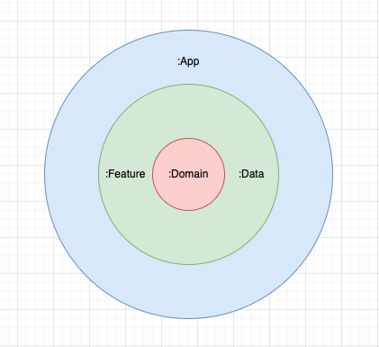
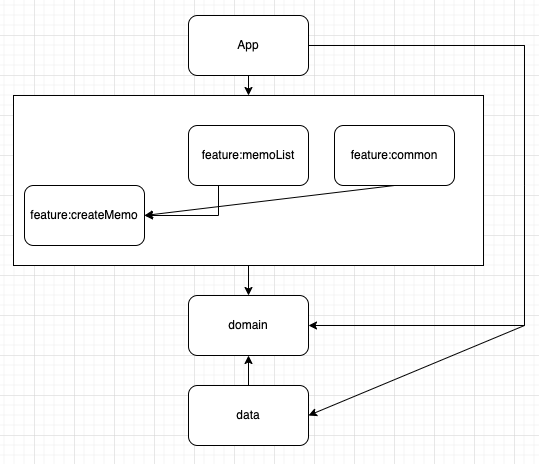

# Multi module practice

멀티 모듈 연습을 위한 프로젝트입니다.

## 멀티 모듈을 사용하는 이유?

코드가 많아질수록 코드 베이스는 복잡해지며 이는 가독성, 확장성 등의 코드 품질을 저해합니다.  
모듈화는 하나의 코드베이스를 관심사에 따라 나누어 코드 품질을 개선합니다.

모듈화가 적절하게 수행된 모듈들은 아래의 이점을 제공합니다.

재사용성: 각 모듈은 부여된 관심사를 완변하게 수행할 수 있는 단위임으로 이를 조합하여 여러 앱들을 빌드할 수 있습니다.

가시성제어: 모듈 외부로부터 코드 노출을 제한합니다. 모듈에게 캡슐화를 부여하며 의존관계를 줄여서 확장성을 높입니다.

## 모듈 사이의 관계 그래프

### 계층 그래프

clean architecture를 바탕으로 계층관계를 형성합니다.

  

내부 원으로 들어갈수록 저수준에서 고수준의 정책을 담당합니다.

외부 원은 내부 원을 참조하지만 반대로의 참조는 금지됩니다.

### 의존 관계 설명

각 화살표는 의존을 나타냅니다.

  

#### app
: 프로젝트의 진입점입니다. 의존성 주입을 담당하며 안드로이드 프레임워크를 필요하는 기능들을 구현합니다.

navigator을 구현하여 feature 모듈로, FileProvider을 구현하여 data 모듈로 주입합니다.

#### feature
: 기능 모듈로 사용자가 상호작용하는 화면을 담당합니다.

공통의 기능을 구현하는 common이 존재하며 common 모듈을 제외하곤 feature 모듈 사이의 종속성은 허용하지 않습니다.

기능 모듈 사이의 화면 전환을 위해 feature::common가 navigator interface를 포함하며 이는 app 모듈에서 구현됩니다.

#### data
: repository 구현을 포함합니다. usecase와 구체화된 저장소 사이의 어뎁터 역할을 수행합니다.

이 프로젝트에서는 usecase와 file 데이터 사이의 어뎁터 역할을 합니다.

로컬 저장소 참조를 위한 FileProvider interface는 app 모듈에서 구현됩니다.

#### domain
: 앱의 비즈니스 로직과 비즈니스 로직에 필요한 model을 포함합니다.

저장소 데이터를 참조하기 위한 repository interface는 data 모듈에서 구현합니다.

## TBD

ViewModel, UiState reducer 분리   
-> viewModel 관심사 분리. Configuration chagne 상황에서의 데이터 보존과 상태 업데이트를 담당하는 uistate reducer로 분리

Data, Domain 모듈을 android library 에서 Kotlin library로 전환   

UI state flow 분리   
-> UiState가 과도하게 커지는 경우 상관관계가 없는 property 업데이트에도 전체적인 uiState 업데이트 및 관리 비용이 발생함. 

## 참고 자료

[https://developer.android.com/topic/modularization](https://developer.android.com/topic/modularization)

